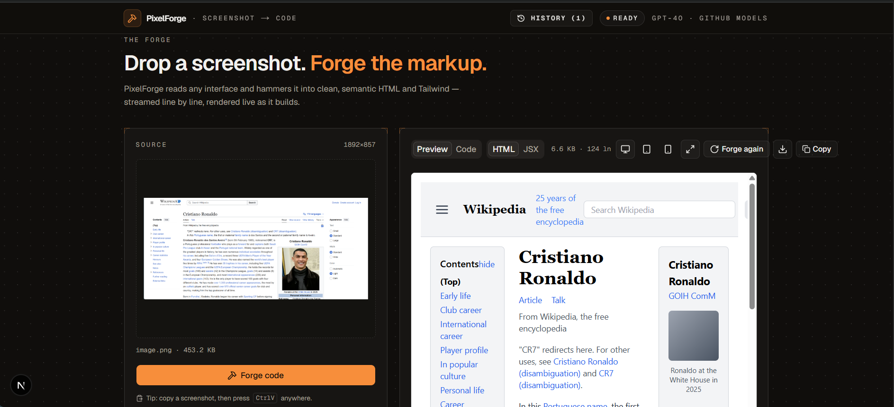
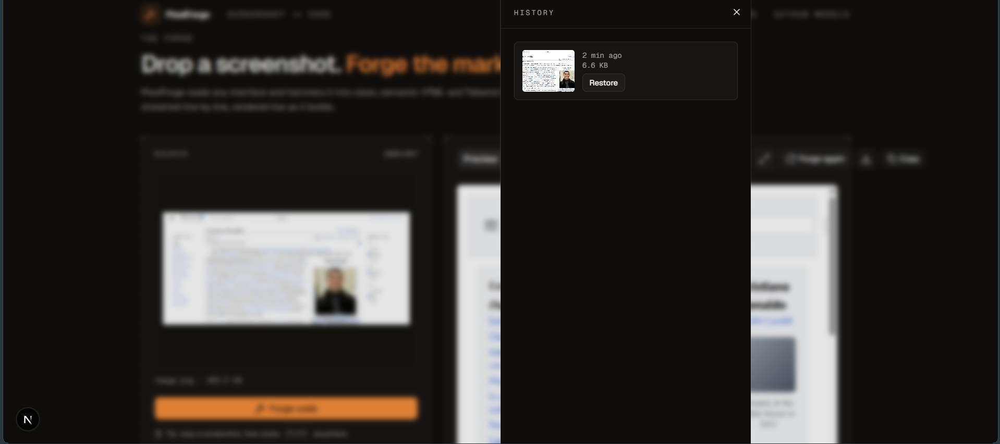

<p align="center">
  
</p>

<h1 align="center">PixelForge</h1>

<p align="center">
  An instrument for turning UI screenshots into clean, semantic HTML and Tailwind.<br/>
  Drop a screenshot. Forge the markup. Streamed live as the model writes it.
</p>

<p align="center">
  <a href="https://pixel-forge-three-nu.vercel.app/"><b>Live demo</b></a> ·
  <a href="#getting-started"><b>Get started</b></a> ·
  <a href="https://github.com/TheMEGALODON55681/PixelForge/issues"><b>Report a bug</b></a> ·
  <a href="#roadmap"><b>Roadmap</b></a>
</p>

<p align="center">
  <a href="https://nextjs.org/"></a>
  <a href="https://www.typescriptlang.org/"></a>
  <a href="https://tailwindcss.com/"></a>
  <a href="https://opensource.org/licenses/MIT"></a>
</p>

---

## Overview

<p align="center">
  
</p>

PixelForge is a screenshot-to-code tool with a deliberate point of view: it should feel less like a chat box and more like an engineering instrument. You drop a screenshot of any interface — a marketing hero, a dashboard, a Wikipedia article, a mobile app screen — and watch GPT-4o stream HTML and Tailwind back as the model writes it, with a live preview rendering the markup as each token arrives.

Built with Next.js 16, the Vercel AI SDK, and GPT-4o vision via GitHub Models.

**Try it live:** [pixel-forge-three-nu.vercel.app](https://pixel-forge-three-nu.vercel.app/)

## What's new

- **[2026/06]** Live deployment on Vercel — [pixel-forge-three-nu.vercel.app](https://pixel-forge-three-nu.vercel.app/)
- **[2026/06]** Major UI overhaul: ember-on-graphite design language, hairline panels with corner registration ticks, live byte/line telemetry, real responsive layout
- **[2026/06]** Generation history (last 10 in session), framework toggle (HTML or JSX), one-click download, device-width preview (desktop / tablet / mobile), keyboard shortcuts (paste, forge, copy, download, history)
- **[2026/06]** Paste-a-screenshot directly with ⌘V / Ctrl+V, real drag-and-drop, "Try with an example" for first-time visitors
- **[2026/05]** Fidelity-tuned system prompt — inline SVG icons, gradient placeholders, full color reproduction (not grayscale)
- **[2026/05]** Initial release: streaming generation, sandboxed live preview, dark UI

## Features

The product does one thing, and tries to do it better than anything else.

- **Live token streaming.** Code appears progressively, not after a 30-second wait. First token typically lands within ~2 seconds.
- **Live preview.** A sandboxed iframe with `srcDoc` renders the partial HTML using Tailwind's Play CDN. The preview updates as the model writes.
- **Color and icon fidelity.** The system prompt explicitly demands real brand colors and inline SVG icons — not grayscale wireframes with icon names as text.
- **HTML or JSX output.** Toggle between raw HTML and React-ready JSX. The server-side prompt swaps in a JSX rider that handles `className`, self-closing void elements, and camelCased event handlers.
- **Session history.** The last 10 generations stay one click away. Restore any of them to keep iterating without losing earlier work.
- **Device-width preview.** Constrain the preview iframe to 375px (mobile) or 768px (tablet) to verify that generated breakpoints actually reflow.
- **Real input ergonomics.** Drag-and-drop, click-to-upload, paste-a-screenshot with ⌘V/Ctrl+V — all three work, all three are how people actually use screenshots.
- **Keyboard-first controls.** ⌘Enter to forge, ⌘C to copy, ⌘S to download, ⌘/ for the shortcuts panel.
- **Sandboxed by design.** `sandbox="allow-scripts"` with no `allow-same-origin` — generated content cannot reach back into the host app.

<p align="center">
  
</p>

## 📊 Architecture & Knowledge Graph

This project includes a generated **knowledge graph** mapping all components, functions, utilities, and design decisions across the codebase.

**Graph Stats:**
- **225 nodes** (components, functions, configs, concepts, design notes)
- **285 edges** (dependencies, references, semantic relationships)
- **19 communities** (natural clusters of related functionality)
- **Core abstractions:** `cn()` utility (27 connections), PixelForge Roadmap, streaming pipeline, UI components

### Explore the Architecture

- **Interactive 3D Graph:** [`docs/architecture/graph.html`](docs/architecture/graph.html) — open locally to zoom, pan, and click nodes
- **Full Report:** [`docs/architecture/GRAPH_REPORT.md`](docs/architecture/GRAPH_REPORT.md) — communities, cohesion metrics, refactoring suggestions, isolated nodes
- **Raw Graph Data:** [`docs/architecture/graph.json`](docs/architecture/graph.json) — structured data for programmatic use

### Why This Matters

The knowledge graph lets you (or anyone onboarding):
- **Understand architecture instantly** — no need to read all 33 files
- **Spot design flaws** — identifies isolated components, weak cohesion areas, missing edges
- **Find integration points** — shows which nodes bridge communities (high-impact when changed)
- **Plan refactors** — community cohesion scores suggest where to split modules

### Generated With

[graphify](https://github.com/slang-ai/graphify) + Claude subagents for semantic extraction

---

## How it works

PixelForge breaks down screenshot-to-code into a streaming pipeline:

1. **Upload stage.** The image is validated client-side (type, size up to 10MB), then sent as multipart form data to the `/api/generate` route handler.

2. **Inference stage.** The route handler base64-encodes the image and constructs a multimodal chat completion request to GPT-4o via GitHub Models. A fidelity-tuned system prompt demands semantic HTML with Tailwind utility classes, inline SVG icons, real brand colors, and gradient placeholders for images — no markdown fences, no preamble.

3. **Streaming stage.** The model's response is returned as a text stream using the Vercel AI SDK's `streamText` → `toTextStreamResponse()`. The client reads the `ReadableStream` chunk-by-chunk and updates state on every token. An `AbortController` cancels in-flight work if the user re-submits or navigates away.

4. **Render stage.** As code streams in, a sandboxed iframe with `srcDoc` re-renders the partial HTML using Tailwind's Play CDN. The user sees code and preview evolving live, with an Idle → Forging → Ready status indicator and live byte/line telemetry.

## Tech stack

| Layer | Technology |
|-------|------------|
| Framework | Next.js 16 (App Router, Turbopack) |
| Language | TypeScript (strict) |
| Styling | Tailwind CSS v4 (CSS-first config) |
| UI primitives | shadcn/ui (radix-nova preset) |
| AI integration | Vercel AI SDK |
| Model | GPT-4o via GitHub Models |
| Icons | Lucide React |
| Notifications | Sonner |
| Hosting | Vercel |

## Getting started

> Just want to try it? Open the **[live demo](https://pixel-forge-three-nu.vercel.app/)** — no setup required.
>
> To run it yourself or contribute, follow the steps below.

### Prerequisites

- Node.js 20 or higher
- A GitHub account with access to [GitHub Models](https://github.com/marketplace/models)
- A GitHub Personal Access Token with `Models: Read-only` permission

### Installation

```bash
git clone https://github.com/TheMEGALODON55681/PixelForge.git
cd PixelForge
npm install
```

### Configuration

Create a `.env.local` file in the project root:

```
GITHUB_MODELS_TOKEN=your_github_pat_here
```

### Run locally

```bash
npm run dev
```

Open [http://localhost:3000](http://localhost:3000).

## Keyboard shortcuts

| Key | Action |
|-----|--------|
| `⌘V` / `Ctrl+V` | Paste a screenshot from the clipboard |
| `⌘Enter` / `Ctrl+Enter` | Forge / re-forge code |
| `⌘C` / `Ctrl+C` | Copy generated code |
| `⌘S` / `Ctrl+S` | Download generated code |
| `⌘H` / `Ctrl+H` | Toggle the history drawer |
| `⌘/` / `Ctrl+/` | Show the shortcuts panel |
| `Esc` | Close any open dialog |

## Design decisions

A few choices worth flagging:

**Why GitHub Models instead of OpenAI directly?**
GitHub Models is a free, OpenAI-compatible inference endpoint that gives access to GPT-4o-tier models without billing setup. The Vercel AI SDK works with it via `createOpenAI({ baseURL })`. GitHub Models supports the Chat Completions API but not the newer Responses API, so the provider is called via `.chat()` explicitly.

**Why streaming?**
Vision generation takes 20–30 seconds. Without streaming, the UI freezes and feels broken. With streaming, the first token arrives within ~2 seconds and the user can read the markup as it forms — perceived latency drops by an order of magnitude.

**Why an iframe with Tailwind Play CDN for preview?**
Generated HTML uses arbitrary Tailwind classes that can't be known at build time. Rendering inline would require runtime JIT in the parent app and risks style leakage. A sandboxed iframe with `srcDoc` solves both: it loads Tailwind via CDN for runtime compilation, and `sandbox="allow-scripts"` (without `allow-same-origin`) isolates generated content from the host app.

**Why force the model to skip markdown code fences (and clean them anyway)?**
GPT-4o ignores explicit "no code fences" instructions a meaningful fraction of the time. The system prompt asks; a `stripCodeFences` regex cleans up when the model doesn't listen. Defense in depth — the same principle as validating input on both client and server.

**Why a single dark theme?**
The preview must render on white. Dark chrome around a white artboard reads like an instrument — drafting table, workbench, forge. A light theme would put the preview on the same brightness as the surrounding UI and dissolve the visual hierarchy. The trade-off is honest: this is a tool that does one job; a second theme would be decoration, not function.

## Roadmap

Near term:
- [x] Production deployment on Vercel — [live](https://pixel-forge-three-nu.vercel.app/)
- [ ] Persist session history and preferences across reloads
- [ ] Syntax highlighting in the Code view (Shiki)

Mid term:
- [ ] **Refinement loop** — "make the header sticky," "use a 3-column grid" — re-runs the model with the previous code + a natural-language instruction
- [ ] Multi-framework output: HTML, React (JSX/TSX), Vue SFC
- [ ] Element-level inspection: redraw a region of the screenshot and regenerate just that fragment
- [ ] Automated accessibility audit of generated output

Long term:
- [ ] Optional accounts + shareable generation links
- [ ] Design-system-aware generation (emit code in the user's component library)
- [ ] Figma frame and live-URL ingestion

## Acknowledgments

- Inspired by [`screenshot-to-code`](https://github.com/abi/screenshot-to-code) by Abi Raja — the project that established this category. PixelForge is a from-scratch reimplementation built to explore the architecture firsthand using a different stack (Next.js + Vercel AI SDK vs. FastAPI + WebSockets).
- UI primitives from [shadcn/ui](https://ui.shadcn.com) (radix-nova preset)
- Icons from [Lucide](https://lucide.dev)
- Streaming via [Vercel AI SDK](https://sdk.vercel.ai)
- Inference via [GitHub Models](https://github.com/marketplace/models)

## License

MIT — see [LICENSE](LICENSE) for details.

---

<p align="center">
Built by <a href="https://github.com/TheMEGALODON55681">Aryan Sharma</a> · 2026
</p>