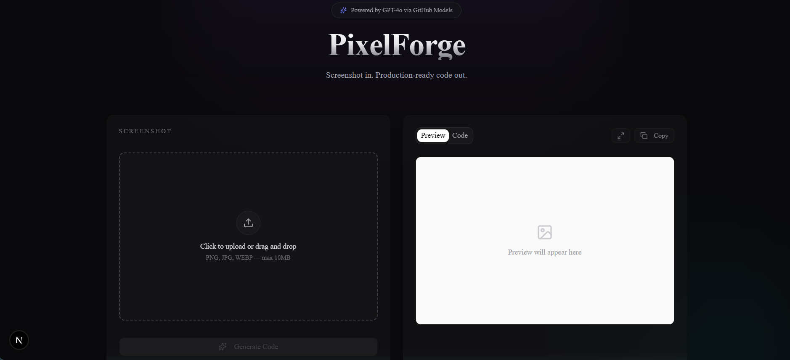

<p align="center">
  
</p>

# PixelForge: Screenshot-to-Code with Multimodal AI

<p align="center">
| <a href="#"><b>Live Demo (coming soon)</b></a> | <a href="https://github.com/TheMEGALODON55681/PixelForge/issues"><b>Report a Bug</b></a> | <a href="#roadmap"><b>Roadmap</b></a> |
</p>

**Latest** ✨

- [2026/05] Initial release — streaming code generation, fullscreen live preview, dark UI
- [2026/05] Integrated GitHub Models for free GPT-4o vision inference
- [2026/05] Added sandboxed live HTML rendering via iframe with Tailwind CDN

[](https://nextjs.org/)
[](https://www.typescriptlang.org/)
[](https://tailwindcss.com/)
[](https://opensource.org/licenses/MIT)

## Overview

<p align="center">
  
</p>

PixelForge is a multimodal AI tool that converts UI screenshots into production-ready HTML and Tailwind CSS code. Drop in a screenshot of any user interface — a website hero, a dashboard, a mobile app screen — and watch the code generate token-by-token in real time, with an in-browser live preview rendering the result as it builds.

Built with Next.js 16, the Vercel AI SDK, and GPT-4o vision via GitHub Models.

## How PixelForge Works

PixelForge breaks down the screenshot-to-code task into a streaming pipeline:

1. **Upload Stage** — Image is validated client-side (type, size up to 10MB), then sent as multipart form data to the `/api/generate` route handler.

2. **Inference Stage** — The route handler base64-encodes the image and constructs a multimodal chat completion request to GPT-4o via GitHub Models. A carefully tuned system prompt guides the model to output semantic HTML with Tailwind utility classes — no markdown fences, no preamble, just the markup.

3. **Streaming Stage** — The model's response is returned as a text stream using the Vercel AI SDK's `streamText` → `toTextStreamResponse()`. The client reads the `ReadableStream` chunk-by-chunk and updates state on every token.

4. **Render Stage** — As code streams in, a sandboxed iframe with `srcDoc` re-renders the partial HTML using Tailwind's Play CDN for runtime JIT compilation. The user sees both the code and the rendered output evolving live.

## Features

- **Multimodal vision input** — drop any UI screenshot (PNG, JPG, WEBP, max 10MB)
- **Live token streaming** — code appears progressively, not after a 30-second wait
- **Sandboxed live preview** — rendered HTML in an isolated iframe with Tailwind JIT
- **Fullscreen preview mode** — expand the rendered preview to 95% viewport for inspection at scale
- **One-click copy** — clipboard-ready code with optimistic UI feedback
- **Defense-in-depth output cleaning** — strips markdown code fences if the model wraps output despite instructions otherwise

## Tech Stack

| Layer | Technology |
|-------|------------|
| Framework | Next.js 16 (App Router) |
| Language | TypeScript |
| Styling | Tailwind CSS v4 |
| UI Components | shadcn/ui (Radix + Nova preset) |
| AI Integration | Vercel AI SDK |
| AI Model | GPT-4o via GitHub Models |
| Icons | Lucide React |
| Hosting | Vercel (coming soon) |

## Getting Started

### Prerequisites

- Node.js 20 or higher
- A GitHub account with access to [GitHub Models](https://github.com/marketplace/models)
- A GitHub Personal Access Token with `Models: Read-only` permission

### Installation

​```bash
git clone https://github.com/TheMEGALODON55681/PixelForge.git
cd PixelForge
npm install
​```

### Configuration

Create a `.env.local` file in the project root:

​```
GITHUB_MODELS_TOKEN=your_github_pat_here
​```

### Run Locally

​```bash
npm run dev
​```

Open [http://localhost:3000](http://localhost:3000).

## Design Decisions

A few choices worth flagging:

**Why GitHub Models instead of OpenAI directly?**
GitHub Models is a free, OpenAI-compatible inference endpoint that gives access to GPT-4o-tier models without billing setup. The Vercel AI SDK works seamlessly with it via `createOpenAI({ baseURL })`. Note: GitHub Models supports the Chat Completions API but not the newer Responses API, so the provider is called via `.chat()` explicitly.

**Why streaming?**
Code generation takes 20–30 seconds. Without streaming, the UI freezes and feels broken. With streaming, the first token arrives within ~2 seconds — perceived latency drops by an order of magnitude.

**Why an iframe with Tailwind Play CDN for preview?**
Generated HTML uses arbitrary Tailwind classes that can't be known at build time. Rendering inline would require runtime JIT in the parent app and risks style leakage. A sandboxed iframe with `srcDoc` solves both: loads Tailwind via CDN for runtime compilation, and `sandbox="allow-scripts"` isolates the generated content from the host app.

**Why force the model to skip markdown code fences (and clean them anyway)?**
GPT-4o ignores explicit "no code fences" instructions a meaningful fraction of the time. The system prompt asks; the `stripCodeFences` regex cleans up when it doesn't. Defense in depth — the same principle as input validation on both client and server.

## Roadmap

- [ ] Mobile responsive polish
- [ ] Production deployment + custom domain
- [ ] "Iterate" mode — refine generations with follow-up natural-language prompts
- [ ] Multi-framework output (React/JSX, Vue, plain HTML)
- [ ] Component extraction — detect multi-component screenshots and split output into separate files

## Acknowledgments

- Inspired by [`screenshot-to-code`](https://github.com/abi/screenshot-to-code) by Abi Raja — the project that established this category. PixelForge is a from-scratch reimplementation built to explore the architecture firsthand using a different stack (Next.js + Vercel AI SDK vs. FastAPI + WebSockets).
- UI components from [shadcn/ui](https://ui.shadcn.com)
- Icons from [Lucide](https://lucide.dev)
- AI streaming via [Vercel AI SDK](https://sdk.vercel.ai)
- AI inference via [GitHub Models](https://github.com/marketplace/models)

---

<p align="center">
Built by <a href="https://github.com/TheMEGALODON55681">Aryan Sharma</a> · 2026
</p>